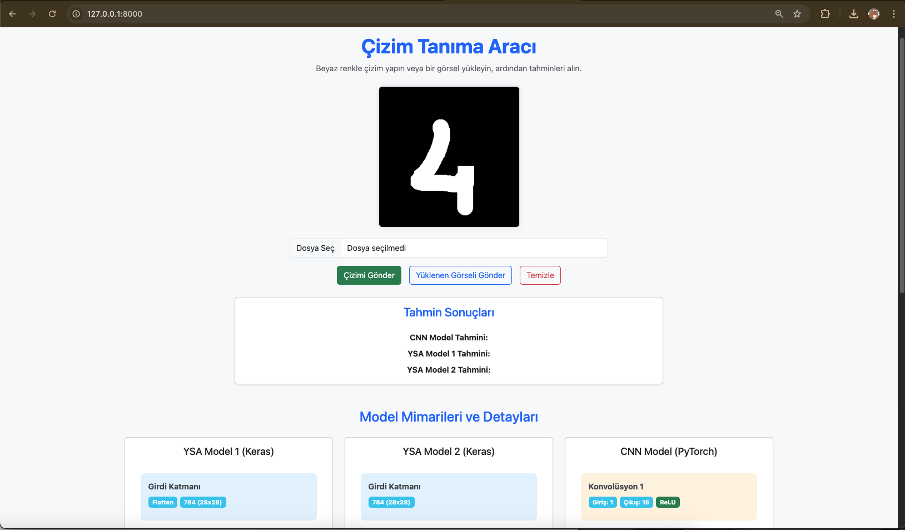
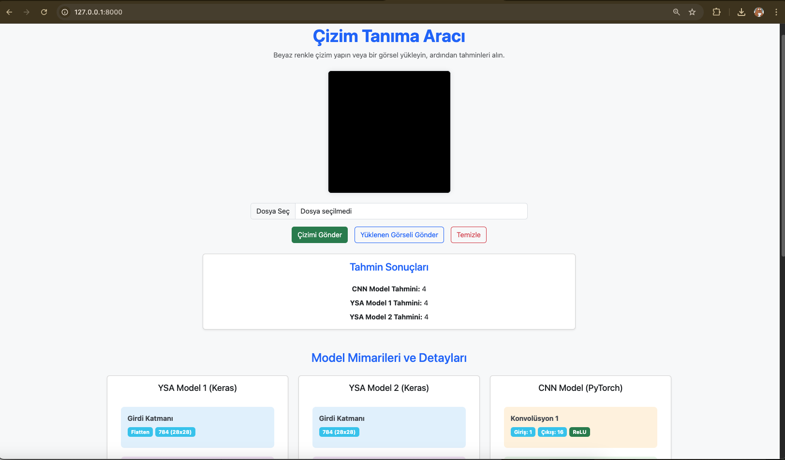
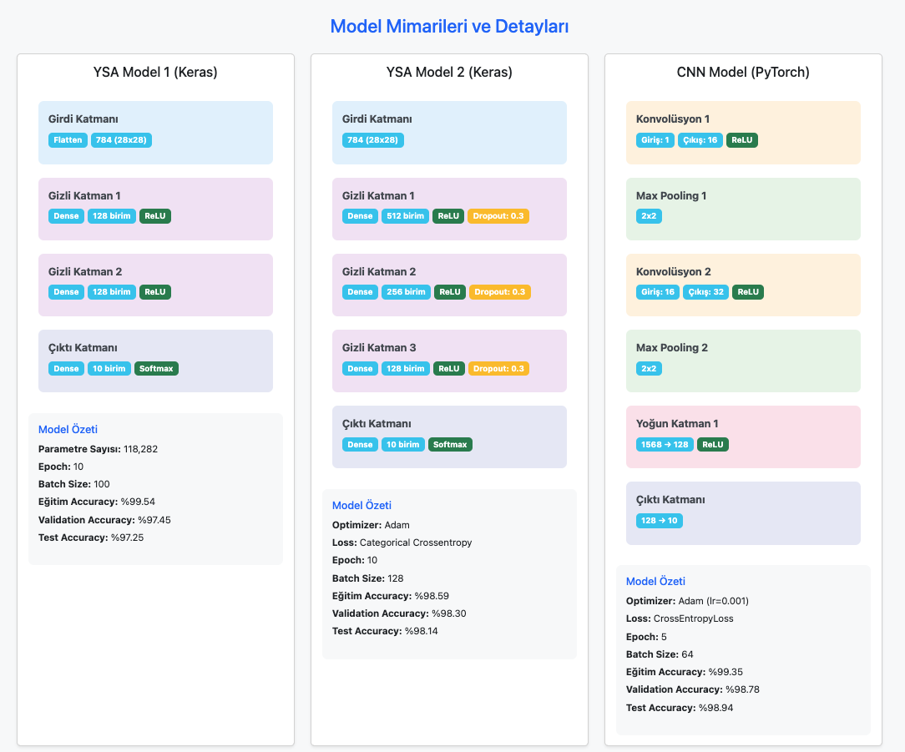

# El Yazısı Rakam Tanıma Projesi

Bu proje, el yazısı rakamları tanımak için üç farklı derin öğrenme modeli kullanan bir web uygulamasıdır. Kullanıcılar çizim yapabilir veya görsel yükleyebilir ve modellerin tahminlerini görebilirler.

## 🚀 Özellikler

- Gerçek zamanlı çizim yapabilme
- Görsel yükleme desteği
- Üç farklı model ile tahmin:
  - YSA Model 1 (Basit Yapay Sinir Ağı)
  - YSA Model 2 (Derin Yapay Sinir Ağı)
  - CNN Model (Evrişimli Sinir Ağı)
- Model mimarilerinin görselleştirilmesi
- Performans metriklerinin gösterimi

## 🎯 Kullanım

1. Web tarayıcınızda `http://localhost:8000` adresine gidin
2. Canvas üzerinde beyaz renkle çizim yapın veya bir görsel yükleyin
3. "Çizimi Gönder" veya "Yüklenen Görseli Gönder" butonuna tıklayın
4. Üç modelin tahminlerini görüntüleyin




## 🧠 Model Mimarileri

### 1. YSA Model 1 (Keras)
- 4 katman (Flatten + 2 Dense + 1 Output)
- 128 birimli iki gizli katman
- ReLU ve Softmax aktivasyonları
- 118,282 parametre
- Performans:
  - Eğitim: %99.54
  - Doğrulama: %97.45
  - Test: %97.25


### 2. YSA Model 2 (Keras)
- 5 katman (Input + 3 Dense + 1 Output)
- 512, 256 ve 128 birimli gizli katmanlar
- Her gizli katmanda %30 dropout
- Adam optimizer ve Categorical Crossentropy loss
- Performans:
  - Eğitim: %98.59
  - Doğrulama: %98.30
  - Test: %98.14


### 3. CNN Model (PyTorch)
- 6 katman (2 Conv + 2 Pool + 1 Dense + 1 Output)
- 16 ve 32 kanallı konvolüsyon katmanları
- 2x2 max pooling
- 128 birimli yoğun katman
- Performans:
  - Eğitim: %99.35
  - Doğrulama: %98.78
  - Test: %98.94

## 📊 Sonuçlar

Modellerin mimari ve performans karşılaştırması:




## 🛠️ Teknolojiler

- Backend:
  - Python
  - Django
  - TensorFlow/Keras
  - PyTorch
- Frontend:
  - HTML5
  - CSS3
  - JavaScript
  - Bootstrap 5

## 📦 Kurulum

1. Projeyi klonlayın:
```bash
git clone https://github.com/kullaniciadi/annDigitDec.git
cd annDigitDec
```

2. Sanal ortam oluşturun ve aktifleştirin:
```bash
python -m venv venv
source venv/bin/activate  # Linux/Mac
# veya
venv\Scripts\activate  # Windows
```

3. Gerekli paketleri yükleyin:
```bash
pip install -r requirements.txt
```

4. Django uygulamasını çalıştırın:
```bash
python manage.py runserver
```

## 📝 Lisans

Bu proje MIT lisansı altında lisanslanmıştır. Daha fazla bilgi için `LICENSE` dosyasına bakın.

